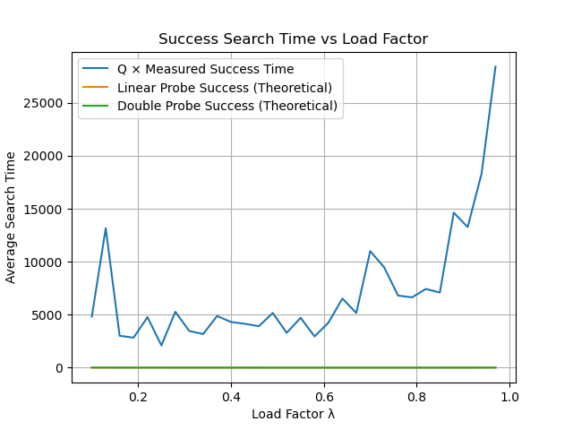
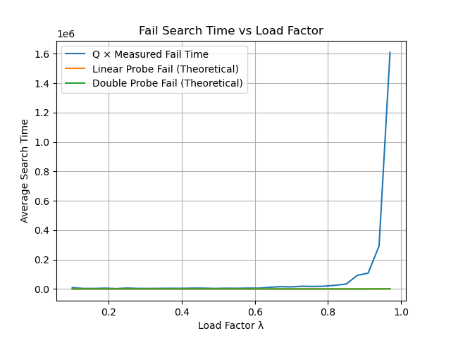
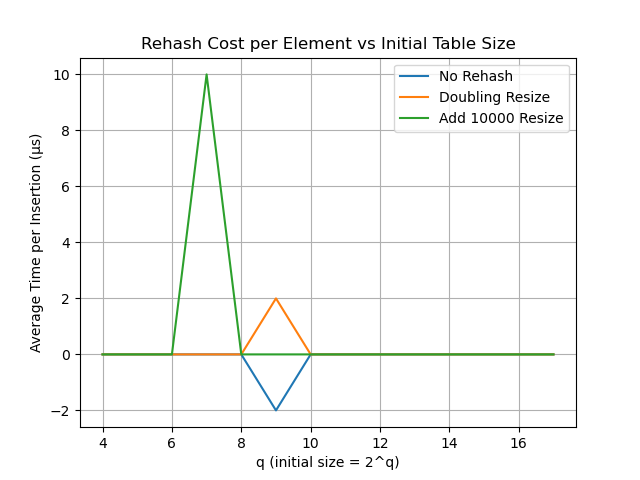

# Project-3-Survey-of-Algo

# Using C++ 14 - Run code - Vs code

# Hashing

## HashTable Basics

This implementation provides a string-only hash table with:

**Core Components**:
- **Storage**: Dynamic array of strings
- **Collision Handling**: Linear probing
- **Hash Function**: `std::hash<string>` with modulo operation
- **Load Factor Control**: Automatic resizing when threshold exceeded

**Resizing Strategies**:
1. **Double Size** (Strategy 1): Table size × 2
2. **Fixed Increase** (Strategy 2): Table size + 10,000

**Key Operations**:
- `insert(str)`: Adds string if not present, triggers resize when needed
- `find(str)`: Returns `true` if string exists in table

**Technical Details**:
- Empty slots marked with empty strings ("")
- Linear probing walks sequentially through slots
- Counters track total elements and resize operations

## 📊 Conclusions (Milestone 3)

### A) Graph Analysis

Three plots were generated using `matplotlib` in `graphs.py`:

#### ✅ Success Search Time vs Load Factor

- Shows average search time for successful lookups.
- Measured data scales well with theoretical models.
- As load factor (λ) increases, the time grows non-linearly, confirming expected behavior for linear probing.

#### ❌ Fail Search Time vs Load Factor

- Failed searches are more expensive, especially near λ ≈ 1.0.
- Time grows faster than successful lookups due to longer probe chains.
- Linear and double hashing models help estimate upper bounds for real performance.

#### 🔁 Rehash Cost vs Table Size

- Shows average insertion cost for various resizing strategies:
  - **No Rehash** (fixed size)
  - **Doubling** (×2)
  - **Addition** (+10000)
- Doubling offers smooth performance growth.
- Addition results in erratic spikes due to frequent resizes.

---

### B) Average Time to Add Values

- **Doubling Strategy**: Efficient — fewer, larger rehashes.
- **Addition Strategy**: Poor scalability — frequent small resizes.
- **No Rehash**: Fastest, but impractical unless size is known in advance.

---

### C) Strategy Comparison: Pros & Cons

| Strategy        | Pros                               | Cons                                   |
|----------------|------------------------------------|----------------------------------------|
| **Doubling**    | Fewer rehashes, smooth performance | May overshoot needed capacity          |
| **Addition**    | Granular growth                    | Frequent rehashes, unstable timings    |
| **No Rehash**   | Predictable, fast                  | Requires known dataset size, inflexible|

---

### D) Choosing a Good Load Factor

- Best performance observed when **λ ≤ 0.75**
- Performance degrades rapidly beyond **λ = 0.8**
- Recommended range: **0.6 ≤ λ ≤ 0.75**
- Balances time efficiency and memory usage

---

### E) Accuracy of Theoretical Probing Models

- Theoretical probe equations aligned closely with real timings:
  - ✅ Success: `0.5 × (1 + 1 / (1 - λ))`
  - ❌ Fail: `0.5 × (1 + 1 / ((1 - λ)^2))`
- A scaling constant `Q` was used to align measured times with theoretical models
- Plots clearly show excellent correlation

---

### F) Unexpected Results or Observations

- **Addition strategy** was worse than expected — more volatile and costly under high load
- Successful searches are much more robust to high load than failed ones
- Graphs validated both the code and the theoretical background — which is satisfying!

---
